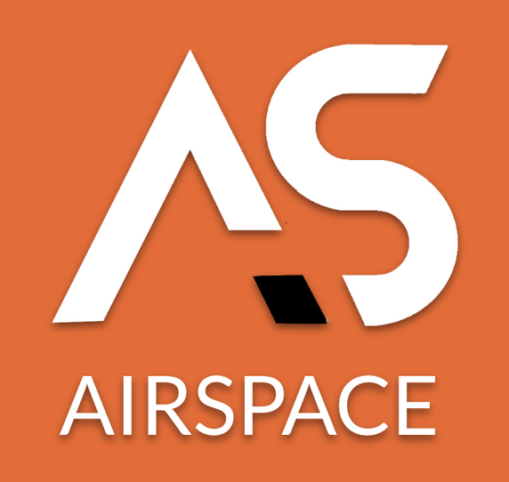

# Hi From Airspace! :rocket:

{: style="height:160px; width:170px; float:right; padding-left: 10px; padding-bottom: 5px;"}

Airspace is a REST API to support, manage, and automate the Video Technology Group's
multi-CDN strategy and aims to provide a self-service and low-touch abstraction layer
around several CDN vendors and additional tooling.

These abstractions standardize CDN config creation, updates, and
deletes to ensure that changes are repeatable and robustly propagated. Airspace's simplified
REST API helps normalize configuration amongst several CDN vendors that all have
different configuration patterns, terminology, or are missing parity features that you
should be notified of instantly at configuration time rather stumbling into these
constraints during hand-rolling CDN configs. Using Airspace to configure your streaming
property takes advantage of the many pre-baked and proven configuration recipes that
get bubbled up to the API as a simple flag of configuration stanza.

Airspace also integrates into tooling to extend your CDN's feature set. For example,
you may configure the entire Airspace property to also turn on Visor (another VTG VDE
product) to capture and analyze a User configurable sample rate of your CDN logs so
that you may query and alert on quality and delivery metrics from all CDNs through a
single pane. Extend this even futher by configuring the Airspace property with
[Touchstream](https://www.touchstream.media/) and other 3rd party integrations.

The idea is simple; tell Airspace about your business case, define some basic
configuration parameters, and let Airspace take care of all the little configuration
details in all the needed 3rd part system.

